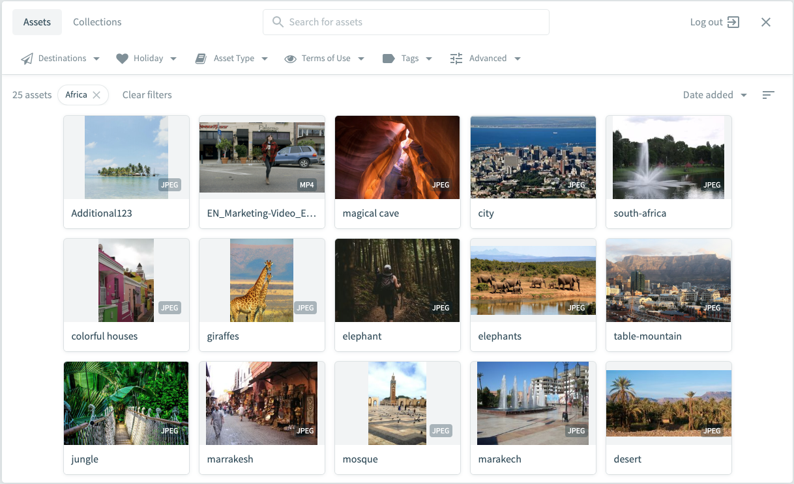
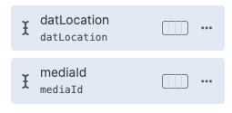

# Unofficial Bynder asset plugin for Craft CMS 5

This unofficial plugin integrates [Bynder Digital Asset Management](https://www.loqus.nl/en/) with Craft CMS 5.x by exposing 
their UCV image selector as a popup that saves the selected image data in a field so the selection 
can be used in twig templates.
 
 
 


# Installation

To install the plugin, follow these instructions.

- Open your terminal and go to your Craft project:

```` 
cd /path/to/project
````

- Then tell Composer to load the plugin:

```
composer require loqus/bynder-craft-cms
```
        
- In the Control Panel, go to Settings → Plugins and click the “Install” button for 'craft-bynder-assets'.

OR do it via the command line

```
php craft install/plugin bynder-craft-cms
```

- On the settings page, fill out the Bynder portal url without https:// to start using the plugin.

## Requirements

2 new fields are required for the plugin to work. Add:
- datLocation
- mediaId

fields to the volume(s)



- If the plugin is installed and the fields have been added you will see two new buttons. One in the asset overview for uploading multiple assets from your Bynder portal


- And one in the asset detail overview to replace the current image


## Important

When an asset has been chosen, the datLocation and mediaId have been filled and the asset has been saved. A 10% quality image will be saved in the original dimensions in the local folder in order for Craft to have a physical (but smaller) asset. 
If you remove the values from the datLocation and mediaId fields and save the asset a full size copy is stored locally as a backup.

## Templating:


### Plain and simple

- The plugin was created as replacement for imager-x

```twig

{% set compressedImage = craft.imager.transformImage(image, {width: 1000,mode: 'crop', position: '50% 50%'}) %}
```

- You can use the same attributes like this:

```twig


 {% set compressedImage = craft.bynder.transformImage(image, {width: 1000,mode: 'crop', position: '50% 50%'}) %}

 {% set compressedImage = craft.imager.transformImage(image, {width: 1000,mode: 'crop', position: '50% 50%'}) %}


```

### Available attributes

 ```twig

The mode accepts the most common used imager and bynder transforms: 'crop', 'fit', 'fill' and 'ratio'
Currently there is no support for complex transforms or srcsets

```


